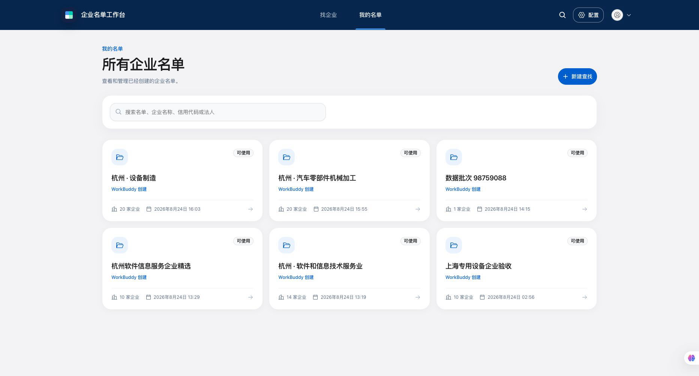
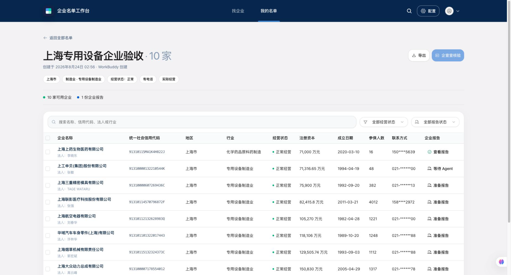
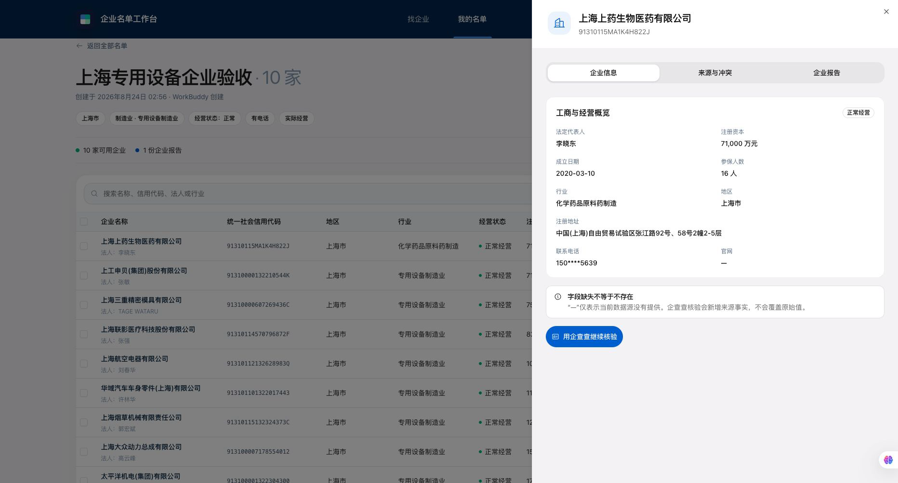
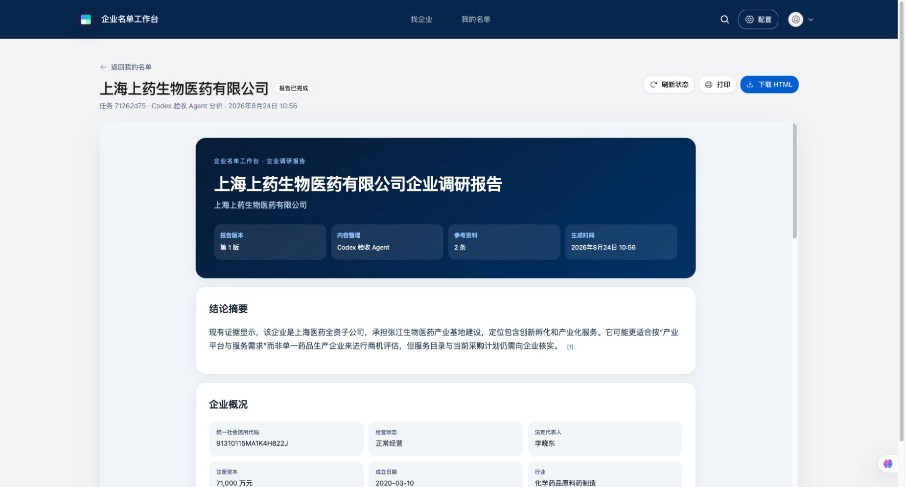
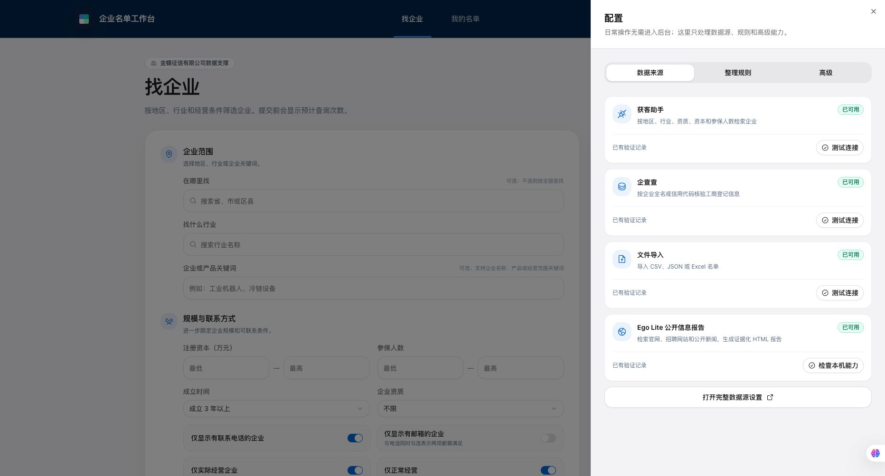

# 企业名单工作台

企业名单工作台是一套可独立运行的 Web 软件。本地版首次只设置一个访问密码，不需要邮箱账号；完成数据源初始化后，用户可以不依赖 Agent，通过图形界面完成企业名单接入、字段映射、去重与冲突检查、规则配置、批量执行、证据审阅和结果导出。

WorkBuddy 与其他 AI 客户端通过受控 MCP 或 REST/OpenAPI 调用同一套应用服务；Agent 是可选入口，不是系统运行依赖。

## 产品演示

<https://github.com/user-attachments/assets/8a4e4b1c-0b62-4004-9e84-c0012f249d3b>

1 分 29 秒演示：找企业 → 我的名单 → 名单详情 → 企业详情 → 企业调研报告。

演示数据来自真实验收环境，画面中的联系电话均已脱敏。[下载 MP4（6.5 MB）](./docs/media/enterprise-lead-workbench-demo.mp4)

## 主要界面

| 找企业 | 我的名单 |
| --- | --- |
|  |  |

| 名单详情 | 企业详情 |
| --- | --- |
|  |  |

| 企业调研报告 | 配置 |
| --- | --- |
|  |  |

## 首批数据源

- 获客助手：由金蝶征信有限公司提供企业名单检索及单企工商司法能力。
- 企查查：首版通过用户自行授权并已实测的 `qcc-agent-cli` 查询企业基本工商登记信息；其他企查查产品只有在取得对应响应契约、授权并完成适配器验收后才开放。
- 文件导入：CSV、XLSX 和 JSON 企业名单。
- 公开信息报告：本机 Ego Lite 为已入库企业采集官网、招聘和公开新闻，生成可追溯资料包；这一步不调用模型，不用网页结果新建企业，不覆盖工商事实。

所有供应商响应先保存原始快照，再按版本化映射生成统一企业字段。字段冲突保留来源和时间，缺失值保持未知，不由模型猜测补全。

## 产品主流程

1. 配置并验证数据源连接。
2. 查询企业或导入已有名单。
3. 确认字段映射、企业身份和数据冲突。
4. 使用可视化规则编辑器创建版本化规则。
5. 执行规则和按需补充核验。
6. 审阅命中证据、人工结论与审计记录。
7. 导出 CSV、XLSX、JSON、HTML，或通过 API/MCP 读取。

## 本地开发

前置环境：Node.js 22、Make、Docker。

```sh
npm ci
npm run start:local
```

该命令会启动 Supabase、供应商任务执行器和 Web UI；只启动前端会导致查询、导入、规则和导出任务一直排队。前端默认地址为 `http://127.0.0.1:3101/`，Supabase Studio 默认地址为 `http://127.0.0.1:54323/`。

首次打开 Web UI 时只设置一个至少 12 位的本机访问密码，工作空间和内部身份由启动器自动创建。以后只需输入该密码解锁；界面不会要求邮箱、验证码或首次管理员初始化码。开发服务只监听 `127.0.0.1`，默认不对局域网开放。

```sh
npm run typecheck
npm run typecheck:worker
npm run lint
npm run test:unit:all
npm run test:unit:app
npm run test:unit:functions
npm run test:unit:worker
npm run build:worker
npm run build
npm run compliance:generate
npm run compliance:check
```

人工验收证据与真实数据链路结果见 [design-qa.md](./design-qa.md)。商用发布时应把 `compliance/sbom.cdx.json`、`compliance/THIRD_PARTY_LICENSES.txt` 和项目版权声明一起归档；合规检查有阻塞项时不得标记为可发布版本。

### 隔离人工验收

如果本机的默认 Supabase 端口已被其他项目或 SSH 隧道占用，可启动一套隔离的完整验收环境：

```sh
npm run start:acceptance
```

浏览器打开 `http://127.0.0.1:5175/`。该环境仍运行生产 Web UI、数据库迁移、Edge Functions 和供应商任务执行器，不使用模拟名单；数据库单独保存在 `.supabase-acceptance`，不会覆盖默认开发数据库。退出前台进程不会删除验收数据，停止隔离 Supabase 可执行 `npm run stop:acceptance`。

生产环境必须在含开发依赖的构建阶段执行 `npm run build:worker`，再把
`services/provider-worker/dist` 与生产依赖一起交付。运行阶段使用
`npm run worker:start`，它只调用 Node.js 和预编译 JavaScript，不依赖 `tsx`
或 TypeScript。`worker:dev` 仅供本地开发使用。

供应商凭证只能保存在服务端 Secret/Vault 中，不得进入浏览器、日志、示例数据、Git 历史或发布包。

## 开源基础与许可证

本项目直接基于 [Atomic CRM](https://github.com/marmelab/atomic-crm) 修改，保留其 React、Supabase、认证、数据访问、管理组件和部署骨架，并重建企业数据、来源证据、规则运行和审计领域。

Atomic CRM 由 Marmelab 以 MIT License 发布。原始版权和许可见 [LICENSE.md](./LICENSE.md)，其他主要依赖声明见 [THIRD_PARTY_NOTICES.md](./THIRD_PARTY_NOTICES.md)。开源代码许可不等同于企查查或金蝶征信数据的缓存、展示及再分发授权，商用范围以对应数据服务合同为准。
